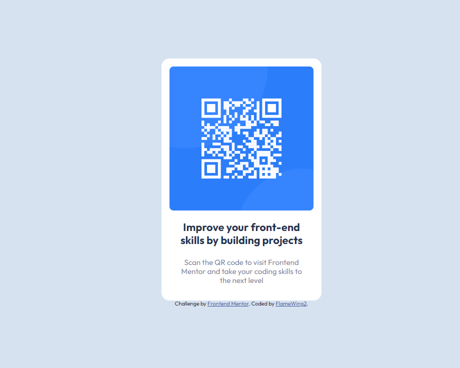

# Frontend Mentor - QR code component solution

This is a solution to the [QR code component challenge on Frontend Mentor](https://www.frontendmentor.io/challenges/qr-code-component-iux_sIO_H). Frontend Mentor challenges help you improve your coding skills by building realistic projects. 

## Table of contents

- [Overview](#overview)
  - [Screenshot](#screenshot)
  - [Links](#links)
- [My process](#my-process)
  - [Built with](#built-with)
  - [What I learned](#what-i-learned)
  - [Continued development](#continued-development)
  - [Useful resources](#useful-resources)
- [Author](#author)
- [Acknowledgments](#acknowledgments)

## Overview

### Screenshot

### Links

- Solution URL: [Add solution URL here](https://your-solution-url.com)
- Live Site URL: [QR-Code component live website](https://flamewing2.github.io/QR-code-component/)

## My process

### Built with

- Semantic HTML5 markup
- CSS custom properties
- Flexbox
- Mobile-first workflow

### What I learned

Through this project I learned about the correct use of HTML5 Semantics, the CUBE CSS methodology (although not completely applied to it as it is a small project), accesibility related topics, like how browsers behave with different font sizes. 

### Continued development

I am looking forward to learn more about the different CSS methodologies and how their approaches apply to different situations while working on web design.

### Useful resources

- [Why font-size must NEVER be in pixels](https://fedmentor.dev/posts/font-size-px/) - This helped me understand why using pixels can cause accesibility issues depending on browser configuration.
- [CUBE CSS](https://cube.fyi/) - This article helped me understand how to take advantage of the Cascade of CSS and the usefulness of creating classes to do specific jobs rather than hardcoding each element individually.
- [Every Layout](https://every-layout.dev) - This article also provided some useful information about how you can work on the layout for your designs. I've only used the free articles though.  

## Author

- Website - Alfredo Albornoz
- Frontend Mentor - [@FlameWing2](https://www.frontendmentor.io/profile/FlameWing2)

## Acknowledgments

I want to give thanks to [@Grace](https://www.frontendmentor.io/profile/Grace-snow) for giving a lot of detailed feedback on my first attempts on tackling this project. It helped me understand that CSS is very complex and the importance of making Internet content more accesible to anyone. 
